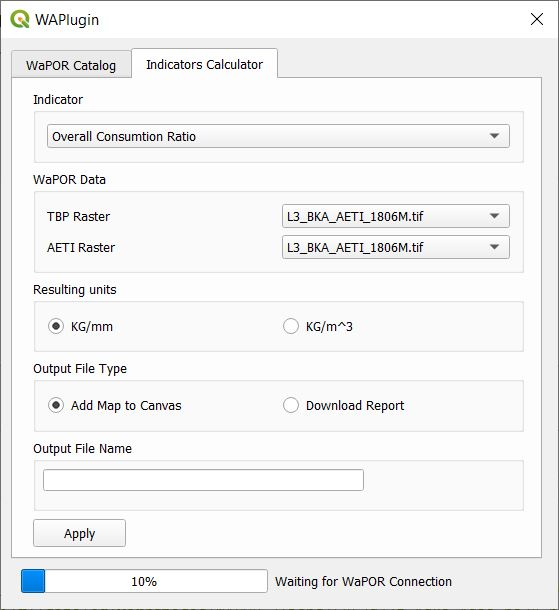

# WAP Pluginn: WaPOR Hackathon Team 17

## Requirements for contributors
* QGIS 3.10

## Installation for contributors

1. Go to the QGIS plugins folder in the path 

    C:\Users\ (USER) \AppData\Roaming\QGIS\QGIS3\profiles\default\python\plugins\

2. Clone or download the git repository
3. Execute the file *compile.bat*
    *If there is a different version of QGIS (3.10) modify the compiler with the actual version*

## Installing new pip packages

1. Open OSGeo4W Shell
2. Run python -m pip install [Package Name]

## User Interface design

