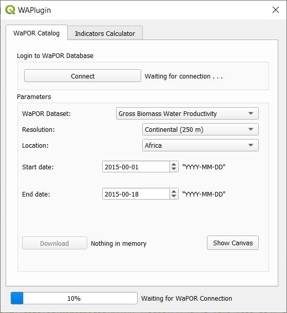

# WAP Plugin: WAGIS Tools and Services

## User Interface design
### Interface for downloading Rasters 

### Interface for calculating Indicators

## For contributors
### Requirements 
* QGIS 3.10

### Installation for contributors
1. Go to the QGIS plugins folder in the path 

    C:\Users\ (USER) \AppData\Roaming\QGIS\QGIS3\profiles\default\python\plugins\

2. Clone or download the git repository
3. Execute the file *compile.bat*
    *If there is a different version of QGIS (3.10) modify the compiler with the actual version*

### Installing new pip packages

1. Open OSGeo4W Shell
2. Run python -m pip install [Package Name]

### Keeping the requirements file updated

1. Open OSGeo4W Shell
2. Run cd C:\Users\ (USER) \AppData\Roaming\QGIS\QGIS3\profiles\default\python\plugins\wap_plugin
3. Run python3 -m pip freeze > requirements.txt                                                                                   
